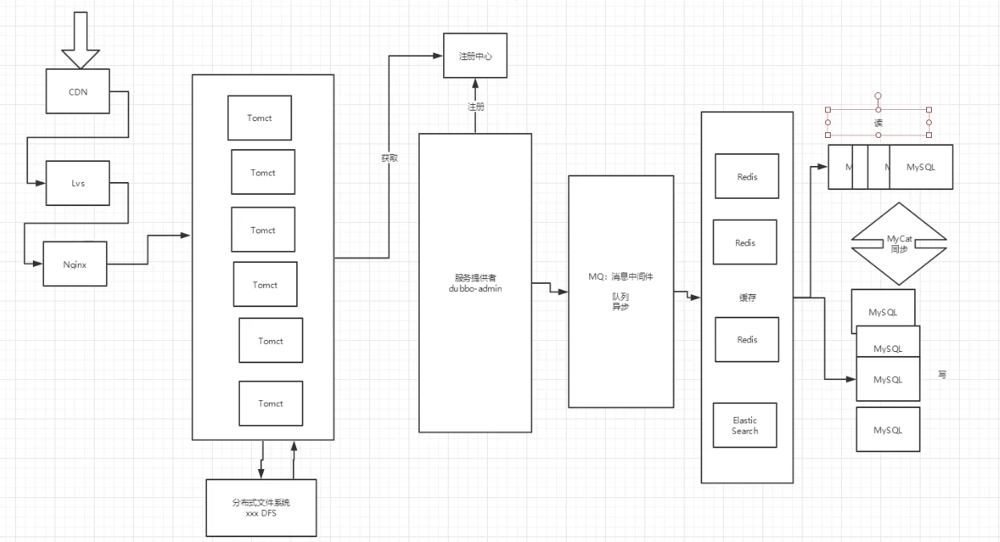
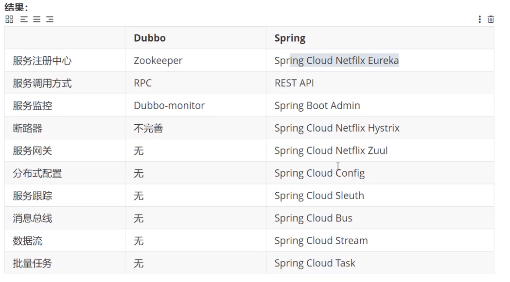
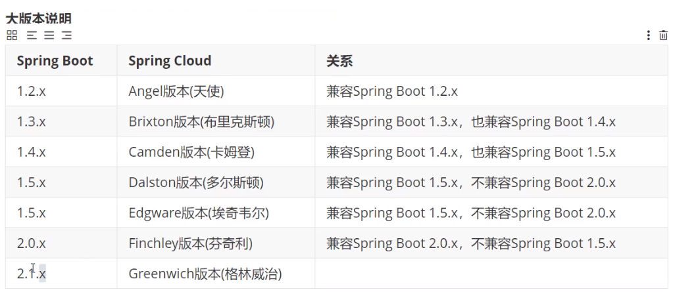
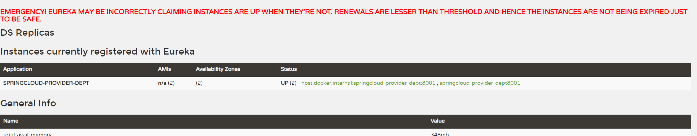
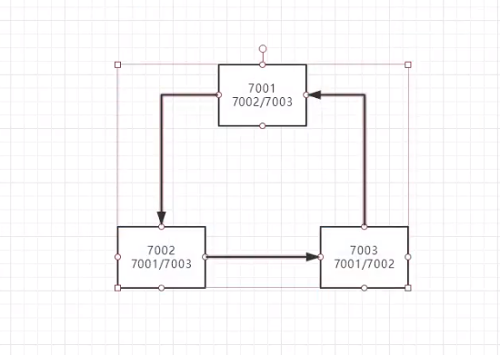

# SpringCloud

**回顾之前的知识~**

- JavaSE
- 数据库
- 前端
- Servlet
- HTTP
- MyBatis
- Spring
- SpringMVC
- SpringBoot
- Dubbo，Zookeeper、分布式基础
- Maven、Git
- Ajax，Json
- 。。。、


**串一下自己会的东西~**

**这个阶段该如何学~**

```java
三层架构	+ 	MVC
    
    
框架实现：
    Spring	IOC	AOP	目的：简化开发（简化代码）
    
	SpringBoot，新一代JavaEE开发标准，自动装配（简化配置）
    
模块化~	All in One
    模块化的开发和all in one，代码没变化~
    
    
微服务架构四个核心问题：
    1. 服务可能会很多，客户端该怎么访问
    2. 这么多服务，服务之间如何通信？
    3. 这么多服务，如何治理？
    4. 服务挂了怎么办？
    
解决方案：
    Spring Cloud不是一个技术，而是一个生态！就是来解决上面四个问题
    
    1. SpringBoot NetFlix 一站式解决方案
    	API网关，Zuul组件
    	
    
    
    2. Apache Dubbo zookeeper	半自动，需要整合别人的
    
    
    3. SpringBoot Alibaba	最新的一站式解决方案！
    
```


## 1. 常见面试题

1. 什么是微服务？
2. 微服务之间是如何独立通讯的？
3. SpringCloud和Dubbo有哪些区别？
4. SpringBoot和SpringClud，请你谈谈对他们的理解
5. 什么是服务熔断？什么是服务降级
6. 微服务的优缺点是什么？说下你在项目开发中遇到的坑
7. 你所知道的微服务技术栈有哪些，请列举一二
8. eureka和zookeeper都可以提供服务注册与发现的功能，请说说两个的区别
9. ......

**什么东西都是两个注解，但是要明白原理，谈资**


## 2. 微服务概述

### 2.1 什么是微服务？


## 3. SpringCloud入门概述

### 3.1 SpringCloud是什么


### 3.2 SpringCloud和SpringBoot的关系

- SpringBoot专注于快速方便地开发单个个体微服务	-jar包
- SpringCloud关注全局的微服务协调治理框架
- SpringBoot可以离开SpringCloud单独使用，开发项目，但是SpringCloud离不开SpringBoot。属于依赖关系
- SpringBoot专注于快速，方便地开发单个个体微服务，SpringCloud关注全局


### 3.3 Dubbo 和 SpringCloud技术选型

#### 3.3.1 分布式 + 服务治理Dubbo

目前乘数的互联网架构：应用服务化拆分 + 消息中间件




#### 3.3.2  Dubbo 和 SpringCloud对比

社区活跃度



**最大区别：SpringCloud抛弃了Dubbo的RPC通信，采用HTTP的Rest方式。**

严格来说，这两种方式各有优劣。虽然从一定程度上来说，后者牺牲了服务调用的性能，但也避免了上面提到的原生RPC带来的问题。而且REST相比于RPC更为灵活，服务提供方和调用放的依赖只依靠一纸契约（只依靠一个连接），不存在代码级别的强依赖，这在强调快速演化的微服务环境下，显得更为合适。


参考书

https://springcloud.cc/spring-cloud-netflix.htm

SpringCloud中国社区: http://springcloud.cn/ 

中文API文档  https://springcloud.cc/spring-cloud-dalston.html

SpringCloud中文网 https://springcloud.cc


### 4.2 SpringCloud版本选择




```xml
<!--打包方式 pom -->
<packaging>pom</packaging>
<properties>
    <junit.version>4.1.2</junit.version>
    <lombol.version>1.16.10</lombol.version>
</properties>

<dependencyManagement>
    <dependencies>

        <!-- https://mvnrepository.com/artifact/org.springframework.cloud/spring-cloud-dependencies -->
        <dependency>
            <groupId>org.springframework.cloud</groupId>
            <artifactId>spring-cloud-dependencies</artifactId>
            <version>Greenwich.SR1</version>
            <type>pom</type>
            <scope>import</scope>
        </dependency>
        <!--SpringBoot-->
        <dependency>
            <groupId>org.springframework.boot</groupId>
            <artifactId>spring-boot-dependencies</artifactId>
            <version>2.1.4.RELEASE</version>
            <type>pom</type>
            <scope>import</scope>
        </dependency>

        <!--数据库-->
        <dependency>
            <groupId>mysql</groupId>
            <artifactId>mysql-connector-java</artifactId>
            <version>5.1.47</version>
        </dependency>

        <dependency>
            <groupId>com.alibaba</groupId>
            <artifactId>druid</artifactId>
            <version>1.1.10</version>
            
        </dependency>

        <dependency>
            <groupId>org.mybatis.spring.boot</groupId>
            <artifactId>mybatis-spring-boot-starter</artifactId>
            <version>1.3.2</version>
        </dependency>

        <dependency>
            <groupId>junit</groupId>
            <artifactId>junit</artifactId>
            <version>${junit.version}</version>
        </dependency>

        <dependency>
            <groupId>org.projectlombok</groupId>
            <artifactId>lombok</artifactId>
            <version>${lombol.version}</version>
        </dependency>

        <dependency>
            <groupId>log4j</groupId>
            <artifactId>log4j</artifactId>
            <version>1.2.17</version>
        </dependency>
    </dependencies>
</dependencyManagement>

如果资源无法导入，还要配置build那个
```


## 5 Eureka服务注册与发现

### 5.1 什么是Eureka

- 怎么读：


统一套路

1. 导入依赖
2. 编写配置文件
3. 开启这个功能@EnableXXX
4. 配置类


SpringCloud五大神兽




自我保护机制：好死不如赖活着


eureka不会立即停止一个崩溃的服务


Eureka集群




CAP原则

只能满足其二

- C（Consistent）


CAP原则又称CAP定理，指的是在一个分布式系统中，[一致性](https://baike.baidu.com/item/一致性/9840083)（Consistency）、[可用性](https://baike.baidu.com/item/可用性/109628)（Availability）、[分区容错性](https://baike.baidu.com/item/分区容错性/23734073)（Partition tolerance）。CAP 原则指的是，这三个要素最多只能同时实现两点，不可能三者兼顾。


zookeeper保证了CP


Eureka保证了AP

P容错性是必须保证的，错了不行


因此，Eureka能够很好地应对网络故障导致部分节点失去联系的情况，而不会想Zookeeper那样是整个注册服务瘫痪。

**狂神的笔记内容复制过来**


## 6 Ribbon

客户端负载均衡（Load Balance，LB）的工具，简单来说就是为客户端提供一些负载均衡算法

cs架构

两种方式

集成式LB

进程式LB


Ribbon默认负载均衡策略


## 7 Feign负载均衡

### 7.1 简介

Feign是声明式的web service客户端，他让微服务之间的调用变得更简单，类似controller调用service。SpringCloud集成了Ribbon和Eureka，可在使用Feign时提供负载均衡的http客户端。


只需要创建一个借口，然后添加注解即可。


feign，java社区的原因，大家都习惯面向接口编程，这个是很多开发人员的规范，调用微服务访问两种方法

1. 微服务名字【Ribbon】
2. 接口和注解【Feign】


Feign默认集成了Ribbon，只是写起来更像Java风格而已，Ribbon更像RestFul风格，Feign性能降低了


## 8 Hystrix

服务熔断